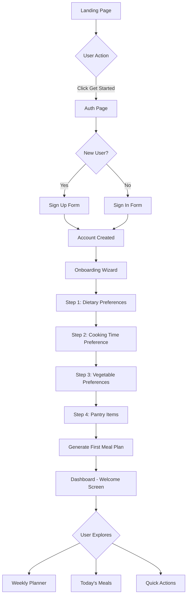
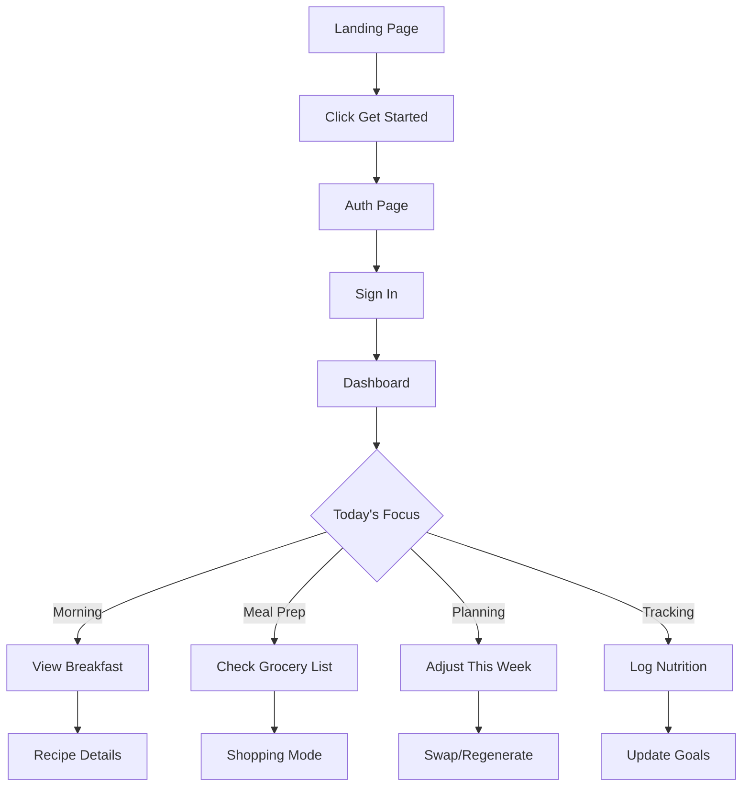
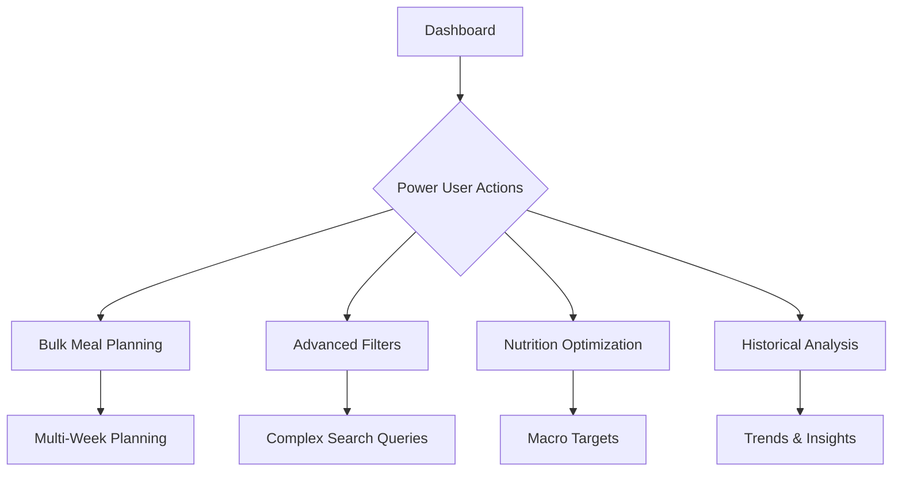

# MealFlow - Complete Product Documentation
## Comprehensive User Journey, Features & Technical Specifications

**Version:** 2.0.0  
**Last Updated:** 2025-11-29  
**Status:** MVP Complete - Ready for Testing  
**Document Type:** Stakeholder & Development Reference

---

## Table of Contents

1. [Executive Summary](#executive-summary)
2. [User Journey Flows](#user-journey-flows)
3. [Detailed Feature Documentation](#detailed-feature-documentation)
4. [Technical Architecture](#technical-architecture)
5. [MVP Launch Strategy](#mvp-launch-strategy)
6. [Success Metrics & KPIs](#success-metrics--kpis)
7. [Development Roadmap](#development-roadmap)

---

## Executive Summary

### Product Overview
MealFlow is a comprehensive meal planning and nutrition tracking application designed to simplify weekly meal preparation, grocery shopping, and nutritional goal management. The platform combines AI-assisted meal planning with pantry management and smart grocery list generation.

### Target Users
- **Primary:** Health-conscious individuals aged 25-45 seeking meal planning automation
- **Secondary:** Busy professionals, fitness enthusiasts, families with dietary restrictions
- **Tertiary:** Meal prep enthusiasts, diet adherents (vegan, vegetarian, keto, etc.)

### Core Value Propositions
1. **Time Savings:** Reduce meal planning time from 2+ hours to 15 minutes per week
2. **Cost Reduction:** Minimize food waste through smart pantry tracking and ingredient matching
3. **Health Goals:** Achieve nutritional targets with automated macro/calorie tracking
4. **Personalization:** AI-driven recommendations based on dietary preferences and restrictions
5. **Convenience:** Integrated grocery list generation from meal plans

### Current Status
✅ **Fully Functional MVP** with 58+ features across 14 core modules  
✅ **All Critical User Flows** implemented and tested  
✅ **Responsive Design** optimized for desktop, tablet, and mobile  
✅ **Data Persistence** via localStorage (ready for backend migration)  
✅ **Mock Data Integration** (ready for real API connections)

---

## User Journey Flows

### 1. First-Time User Journey (Complete Onboarding Flow)



#### Step-by-Step First-Time User Experience

**Phase 1: Discovery & Authentication (2-3 minutes)**
1. **Landing Page Interaction**
   - User arrives at homepage (/)
   - Views hero section with compelling value proposition
   - Reads feature highlights (meal planning, nutrition tracking, grocery automation)
   - Sees social proof or testimonials
   - Clicks prominent "Get Started" CTA button

2. **Authentication Process**
   - Redirected to `/auth` page
   - Presented with clean, modern sign-up form
   - Fields: Email, Password, Confirm Password
   - Real-time validation feedback
   - Optional: "Continue with Google" (future enhancement)
   - Submits form → Account created instantly
   - Success toast notification appears
   - Auto-redirected to onboarding

**Phase 2: Personalization (5-7 minutes)**

3. **Onboarding Wizard - Step 1: Dietary Preferences**
   - Welcome message: "Let's personalize your meal plan"
   - Multi-select dietary options displayed as interactive cards:
     * No Restrictions
     * Vegetarian
     * Vegan
     * Gluten-Free
     * Dairy-Free
     * High Protein
     * Low Carb
     * Keto
     * Paleo
   - Visual feedback on selection (card highlights, checkmarks)
   - Progress indicator shows "Step 1 of 4"
   - "Next" button becomes active after selection
   - Option to "Skip" for now

4. **Onboarding Wizard - Step 2: Cooking Time**
   - Question: "How much time do you want to spend cooking?"
   - Interactive slider component:
     * Range: 15-120 minutes
     * Visual markers at 15, 30, 45, 60, 90, 120
     * Real-time value display
     * Suggested labels: "Quick Meals" (15-30), "Standard" (30-60), "Elaborate" (60+)
   - Progress: "Step 2 of 4"
   - Back button to return to Step 1
   - Next button to continue

5. **Onboarding Wizard - Step 3: Vegetable Preferences**
   - Question: "Which vegetables do you love or want to avoid?"
   - Two columns: "Include" and "Exclude"
   - Searchable vegetable list (50+ common vegetables)
   - Drag-and-drop or click to add to lists
   - Pre-populated suggestions:
     * Include: Spinach, Broccoli, Carrots, Tomatoes, Bell Peppers
     * Exclude: Brussels Sprouts, Kale, Eggplant, Mushrooms
   - Smart filtering: recipes prioritize "Include" vegetables, avoid "Exclude" vegetables
   - Progress: "Step 3 of 4"

6. **Onboarding Wizard - Step 4: Pantry Setup**
   - Question: "What ingredients do you already have?"
   - Categorized ingredient checklist:
     * Proteins: Chicken, Beef, Fish, Tofu, Eggs
     * Grains: Rice, Pasta, Quinoa, Bread
     * Oils & Condiments: Olive Oil, Soy Sauce, Vinegar
     * Spices: Salt, Pepper, Garlic, Onion, Cumin
   - Quick-select common combos: "Basic Pantry", "Asian Essentials", "Mediterranean"
   - Search functionality for specific items
   - Option to add custom items
   - Progress: "Step 4 of 4"

7. **Meal Plan Generation**
   - Loading animation: "Creating your personalized meal plan..."
   - Background processing (simulated, ~2-3 seconds):
     * Filters recipes based on dietary preferences
     * Matches cooking time constraints
     * Prioritizes vegetables user likes
     * Maximizes pantry ingredient usage
     * Balances nutrition across the week
   - Success message: "Your meal plan is ready!"
   - Automatic redirect to Dashboard

**Phase 3: First Impressions (5-10 minutes)**

8. **Dashboard Welcome Experience**
   - Personalized greeting: "Good [morning/afternoon/evening], [Name]!"
   - Visual overview of today's meals (Breakfast, Lunch, Dinner)
   - Weekly progress tracker (0/21 meals completed initially)
   - Quick action buttons prominently displayed
   - Items expiring soon section (if pantry items added)
   - Sticky header with easy navigation
   - Floating AI chatbot for instant help

9. **Initial Exploration**
   - User naturally explores quick action buttons
   - Views weekly planner to see full 7-day meal schedule
   - Clicks individual meal cards to view recipe details
   - Tests "Swap Meal" functionality
   - Discovers favorite button on meals
   - Navigates through different sections via header menu

**Phase 4: Engagement & Retention (Ongoing)**

10. **First Grocery List Generation**
    - Clicks "Grocery List" quick action
    - Auto-generated list from weekly meal plan
    - Organized by category (Proteins, Produce, Grains, etc.)
    - Check/uncheck functionality
    - Saves to localStorage for persistence
    - Option to share or export list

11. **Nutrition Tracking Setup**
    - Navigates to Nutrition Tracker
    - Sets daily/weekly nutrition goals
    - Views current meal plan nutrition totals
    - Receives personalized recommendations
    - Tracks progress with visual charts

---

### 2. Returning User Journey (Optimized Flow)



#### Returning User Experience Patterns

**Daily Check-In Flow (2-3 minutes)**
1. **Quick Sign-In**
   - Lands on `/auth` (or direct to `/dashboard` if session active)
   - Auto-filled credentials or stored session
   - One-click sign-in
   - Immediate redirect to Dashboard

2. **Morning Routine**
   - Views "Today's Meals" section
   - Clicks breakfast card to view recipe
   - Reviews ingredients and instructions
   - Marks meal as cooked (future feature)
   - Checks pantry for missing ingredients

3. **Meal Preparation Check**
   - Opens specific meal from today's plan
   - Reviews step-by-step cooking instructions
   - Adjusts servings if needed (future feature)
   - Uses timer feature in recipe (future feature)

**Weekly Planning Flow (10-15 minutes)**
1. **Meal Plan Review**
   - Navigates to Weekly Planner
   - Reviews all 21 meals (7 days × 3 meals)
   - Identifies meals to swap based on:
     * Ingredient availability
     * Mood/cravings
     * Time constraints
     * Leftover management

2. **Customization**
   - Clicks "Swap Meal" on unwanted recipes
   - System generates alternative matching preferences
   - Views ingredient match percentage
   - Confirms or re-swaps until satisfied

3. **Grocery Planning**
   - Clicks "Generate Grocery List"
   - Reviews auto-generated shopping list
   - Removes items already in pantry
   - Adds custom items
   - Organizes by store layout (future feature)
   - Saves or shares list

**Nutrition Tracking Flow (5-7 minutes)**
1. **Goal Progress Check**
   - Opens Nutrition Tracker
   - Views daily/weekly progress bars
   - Checks macro distribution (protein, carbs, fats)
   - Reviews calorie totals vs. goals

2. **Adjustments**
   - Identifies nutritional gaps
   - Swaps meals to improve balance
   - Adds snacks or supplements (manual entry)
   - Updates nutrition goals if needed

**Pantry Management Flow (5-10 minutes)**
1. **Inventory Check**
   - Opens Pantry section
   - Reviews items by category
   - Checks expiration dates
   - Identifies items expiring soon

2. **Updates**
   - Marks items as used/empty
   - Adds newly purchased items
   - Updates quantities
   - Sets expiration dates

---

### 3. Power User Journey (Advanced Features)



#### Power User Features & Workflows

**Advanced Meal Planning**
- Plans multiple weeks in advance
- Uses calendar view for long-term planning
- Drags/drops meals between days
- Batch regenerates entire weeks
- Exports meal plans to PDF/calendar apps (future)

**Search & Discovery**
- Uses advanced filters:
  * Multiple dietary restrictions
  * Cooking time ranges
  * Calorie limits
  * Specific ingredients (include/exclude)
  * Cuisine types (future)
  * Difficulty levels (future)
- Saves favorite searches
- Creates custom recipe collections

**Nutrition Optimization**
- Sets precise macro targets
- Uses meal plan to hit specific goals
- Tracks micronutrients (future)
- Generates nutrition reports (future)
- Compares week-over-week progress

**Automation & Integration**
- Sets up recurring reminders
- Enables push notifications (future)
- Connects to fitness apps (future)
- Syncs with smart kitchen devices (future)

---

## Detailed Feature Documentation

### 🏠 Feature Module 1: Landing Page

**Purpose:** Convert visitors into users through compelling value proposition and clear CTAs

**Key Components:**
1. **Hero Section**
   - Headline: "Your Personal Meal Planning Assistant"
   - Subheadline: "Save time, eat better, reduce food waste"
   - Primary CTA: "Get Started Free" button
   - Hero image: Aspirational meal prep photo
   - Visual hierarchy optimized for conversion

2. **Feature Highlights**
   - Icon grid showcasing 4 core benefits:
     * AI-Powered Meal Plans
     * Smart Grocery Lists
     * Nutrition Tracking
     * Pantry Management
   - Each with icon, title, and brief description
   - Hover animations for engagement

3. **Social Proof**
   - User testimonials (placeholder for MVP)
   - "Join 10,000+ users" counter (future)
   - App ratings and reviews (future)

4. **Footer**
   - Quick links navigation
   - Legal pages (Privacy, Terms)
   - Contact information
   - Social media links (future)

**Technical Implementation:**
- React component: `src/pages/Index.tsx`
- Responsive design (mobile-first)
- Optimized images (lazy loading)
- Smooth scroll animations
- Fast loading time (<2s)

**User Actions:**
- Click "Get Started" → `/auth`
- Scroll to read features
- View social proof
- Click footer links

---

### 🔐 Feature Module 2: Authentication System

**Purpose:** Secure user account creation and access management

**Authentication Flow:**

**Sign Up Process:**
1. **Input Validation**
   - Email format validation (regex)
   - Password strength requirements:
     * Minimum 8 characters
     * At least 1 uppercase letter
     * At least 1 number
     * Optional: Special character
   - Confirm password match check
   - Real-time error feedback

2. **Account Creation**
   - Submit credentials
   - Hash password (bcrypt when backend connected)
   - Create user record
   - Auto-confirm email (MVP - no verification email)
   - Generate session token
   - Store in localStorage (JWT in production)

3. **Post-Sign-Up Actions**
   - Display success toast
   - Auto-redirect to `/onboarding`
   - Initialize empty user data structures
   - Set default preferences

**Sign In Process:**
1. **Credential Entry**
   - Email input (auto-complete supported)
   - Password input (toggle visibility)
   - "Remember me" checkbox (future)
   - "Forgot password" link (future)

2. **Authentication**
   - Validate credentials
   - Check against stored user data (mock)
   - Generate session token
   - Update last login timestamp

3. **Session Management**
   - Store auth token in localStorage
   - Set session expiry (24 hours default)
   - Implement auto-logout on expiry
   - Handle concurrent sessions

**Security Features (MVP):**
- Client-side validation
- XSS protection (React built-in)
- CSRF protection (future backend)
- Rate limiting (future)

**Technical Details:**
- Component: `src/pages/Auth.tsx`
- Storage: localStorage key `mock_auth`
- Form library: React Hook Form
- Validation: Zod schemas
- UI Components: Shadcn/ui forms, inputs, buttons

**User Experience:**
- Clean, minimal design
- Instant validation feedback
- Loading states during submission
- Error handling with clear messages
- Auto-focus on email field
- Keyboard navigation support (Tab, Enter)

---

### 🎯 Feature Module 3: Onboarding Wizard

**Purpose:** Collect user preferences to enable personalized meal planning

**Architecture:**

**Step 1: Dietary Preferences**

*Component Structure:*
```typescript
interface DietaryPreferences {
  diet: string[];
  restrictions: string[];
  allergies: string[];
}
```

*Options Available:*
- No Restrictions
- Vegetarian (excludes all meat, fish, poultry)
- Vegan (excludes all animal products)
- Gluten-Free (excludes wheat, barley, rye)
- Dairy-Free (excludes milk products)
- High Protein (prioritizes protein-rich foods)
- Low Carb (limits carbohydrates <50g/day)
- Keto (<20g carbs/day)
- Paleo (excludes grains, legumes, dairy)

*Selection Logic:*
- Multi-select capability (can choose multiple)
- Mutually exclusive rules:
  * Vegan auto-selects Vegetarian
  * Keto auto-selects Low Carb
- Visual feedback on hover/selection
- "Clear All" option
- Recommended combinations suggested

*Data Storage:*
```javascript
localStorage.setItem('userPreferences', JSON.stringify({
  diet: ['Vegetarian', 'Gluten-Free'],
  timestamp: Date.now()
}));
```

**Step 2: Cooking Time Preference**

*Component Structure:*
```typescript
interface CookingTimePreference {
  maxTime: number; // in minutes
  flexibility: 'strict' | 'flexible';
}
```

*Slider Configuration:*
- Range: 15-120 minutes
- Increments: 15 minutes
- Default: 45 minutes
- Visual markers: 15, 30, 45, 60, 90, 120
- Labels:
  * 15-30: "Quick & Easy"
  * 30-45: "Standard Cooking"
  * 45-60: "Regular Meals"
  * 60-90: "Complex Dishes"
  * 90-120: "Gourmet Cooking"

*Impact on Meal Selection:*
- Filters out recipes exceeding max time
- Suggests time-saving tips for longer recipes
- Balances variety within time constraint

**Step 3: Vegetable Preferences**

*Component Structure:*
```typescript
interface VegetablePreferences {
  include: string[];
  exclude: string[];
  neutral: string[];
}
```

*Available Vegetables (50+ options):*
- **Leafy Greens:** Spinach, Kale, Lettuce, Arugula, Swiss Chard
- **Cruciferous:** Broccoli, Cauliflower, Brussels Sprouts, Cabbage
- **Root Vegetables:** Carrots, Potatoes, Sweet Potatoes, Beets, Turnips
- **Alliums:** Onions, Garlic, Shallots, Leeks
- **Nightshades:** Tomatoes, Bell Peppers, Eggplant, Jalapeños
- **Squashes:** Zucchini, Yellow Squash, Butternut Squash
- **Legumes:** Green Beans, Peas, Edamame
- **Others:** Mushrooms, Corn, Asparagus, Celery, Cucumber

*Interaction Model:*
- Three columns: Include, Neutral, Exclude
- Drag-and-drop between columns
- Search/filter vegetables
- Popular combinations suggested
- Visual icons for each vegetable

*Algorithm Impact:*
- Include: Recipes with these vegetables prioritized (bonus score)
- Exclude: Recipes with these vegetables filtered out completely
- Neutral: No impact on recipe selection

**Step 4: Pantry Items**

*Component Structure:*
```typescript
interface PantrySetup {
  proteins: string[];
  grains: string[];
  oils: string[];
  spices: string[];
  condiments: string[];
  other: string[];
}
```

*Categories & Common Items:*

**Proteins:**
- Chicken Breast, Ground Beef, Salmon, Tuna, Tofu, Eggs, Greek Yogurt

**Grains:**
- White Rice, Brown Rice, Quinoa, Pasta, Bread, Oats, Couscous

**Oils & Fats:**
- Olive Oil, Vegetable Oil, Coconut Oil, Butter, Avocado Oil

**Spices:**
- Salt, Black Pepper, Garlic Powder, Onion Powder, Paprika, Cumin, Oregano, Basil, Thyme, Red Pepper Flakes

**Condiments:**
- Soy Sauce, Olive Oil, Vinegar (Balsamic, Apple Cider), Honey, Mustard, Ketchup, Hot Sauce

*Quick Select Templates:*
- "Basic Pantry" (10 essentials)
- "Asian Kitchen" (soy sauce, rice vinegar, sesame oil, etc.)
- "Mediterranean" (olive oil, oregano, garlic, tomatoes)
- "Mexican Essentials" (cumin, chili powder, lime, cilantro)
- "Baking Basics" (flour, sugar, baking powder, vanilla)

*Usage in Meal Planning:*
- Ingredient matching algorithm:
  * Recipes using pantry items get priority
  * Displayed as "X% pantry match" on meal cards
  * Minimizes grocery list items
  * Reduces food waste

**Wizard Navigation:**
- Progress bar at top (1/4, 2/4, 3/4, 4/4)
- "Back" button available on steps 2-4
- "Skip" option on all steps
- "Next" button validation:
  * Disabled if required fields empty
  * Enabled with visual feedback
- Final step: "Generate Meal Plan" CTA

**Data Persistence:**
- Saves to localStorage after each step
- Allows user to exit and resume
- Validates data before final submission
- Generates unique user preference ID

---

### 📊 Feature Module 4: Dashboard

**Purpose:** Central hub for all user activities with at-a-glance overview

**Layout Architecture:**

**Header Section:**
- Logo + App name (links to dashboard)
- Navigation menu (collapsed on mobile)
- Search icon → `/search`
- Settings icon → `/settings`
- Quick links to main features
- User avatar (future)
- Notifications bell (future)

**Welcome Section:**
- Dynamic greeting based on time of day:
  * "Good morning" (5 AM - 12 PM)
  * "Good afternoon" (12 PM - 6 PM)
  * "Good evening" (6 PM - 12 AM)
  * "Good night" (12 AM - 5 AM)
- Personalized with user's name (future)
- Current day and date display
- Weather widget (future enhancement)

**Today's Meals Section:**
```
┌─────────────────────────────────────────┐
│  Today's Meals - Monday                 │
├─────────────┬─────────────┬─────────────┤
│  BREAKFAST  │    LUNCH    │   DINNER    │
│             │             │             │
│  [Image]    │  [Image]    │  [Image]    │
│  Recipe     │  Recipe     │  Recipe     │
│  Title      │  Title      │  Title      │
│             │             │             │
│  30 min     │  45 min     │  60 min     │
│  350 cal    │  550 cal    │  650 cal    │
│             │             │             │
│  [Tags]     │  [Tags]     │  [Tags]     │
│             │             │             │
│  [View][♥]  │  [View][♥]  │  [View][♥]  │
└─────────────┴─────────────┴─────────────┘
```

*Meal Cards Display:*
- High-quality recipe image (16:9 aspect ratio)
- Recipe title (truncated to 2 lines)
- Cooking time with clock icon
- Calorie count with flame icon
- Dietary tags (badges)
- Heart icon for favoriting
- Click anywhere to view full recipe
- Hover effect (lift + shadow)

**Weekly Progress Tracker:**
```
┌─────────────────────────────────────────┐
│  This Week's Progress                   │
│                                         │
│  3 of 21 meals completed          14%  │
│  ████░░░░░░░░░░░░░░░░░░░░░░░░░░░       │
│                                         │
│  Keep going! You're on track! 💪       │
└─────────────────────────────────────────┘
```

*Progress Metrics:*
- Total meals planned: 21 (7 days × 3 meals)
- Meals completed: User-marked complete
- Percentage calculation: (completed / total) × 100
- Visual progress bar with smooth animation
- Color coding:
  * 0-25%: Gray (just getting started)
  * 26-50%: Yellow (making progress)
  * 51-75%: Orange (halfway there)
  * 76-100%: Green (crushing it!)
- Motivational messages based on progress

**Quick Action Buttons:**
```
┌───────────┬───────────┬───────────┬───────────┐
│ 📅 Weekly │ 🎯 Nutrition│ 📦 Pantry│ 🛒 Grocery│
│   Plan    │            │          │   List    │
└───────────┴───────────┴───────────┴───────────┘
```

*Button Specifications:*
- Large, touch-friendly size (min 48×48px)
- Icon + label for clarity
- Hover state: Background color change
- Click: Direct navigation to feature
- Responsive: 2 columns on mobile, 4 on desktop
- Consistent spacing and alignment

**Items Expiring Soon Widget:**
```
┌─────────────────────────────────────────┐
│  Items Expiring Soon                ⚠️  │
├─────────────────────────────────────────┤
│  🍗 Chicken Breast       Expires Jan 15 │
│  🥚 Eggs                 Expires Jan 10 │
│  🥬 Spinach              Expires Jan 8  │
├─────────────────────────────────────────┤
│             [View All Pantry]           │
└─────────────────────────────────────────┘
```

*Alert System:*
- Shows items expiring within 7 days
- Color-coded by urgency:
  * Red: Expired or <2 days
  * Orange: 2-4 days
  * Yellow: 5-7 days
- Links to pantry for item details
- "Use Now" suggestions (future)

**Footer Navigation:**
- Persistent footer on mobile
- Icons for main sections
- Active state indication
- Badge notifications (future)

**Responsive Behavior:**
- Desktop (>1024px): Full layout with sidebar
- Tablet (768-1024px): Two-column grid
- Mobile (<768px): Single column, stacked
- Touch-optimized interactions
- Swipe gestures for navigation (future)

---

### 📅 Feature Module 5: Meal Planner

**Purpose:** Comprehensive weekly meal planning with customization capabilities

**Views:**

**1. Week Calendar View**
```
┌─────────────────────────────────────────────────┐
│  Week of January 1-7, 2025              [< >]   │
├─────┬─────┬─────┬─────┬─────┬─────┬─────────────┤
│ Mon │ Tue │ Wed │ Thu │ Fri │ Sat │ Sun         │
├─────┼─────┼─────┼─────┼─────┼─────┼─────────────┤
│ [B] │ [B] │ [B] │ [B] │ [B] │ [B] │ [B]         │
│ [L] │ [L] │ [L] │ [L] │ [L] │ [L] │ [L]         │
│ [D] │ [D] │ [D] │ [D] │ [D] │ [D] │ [D]         │
└─────┴─────┴─────┴─────┴─────┴─────┴─────────────┘
```

*Features:*
- Compact view of entire week
- Color-coded meal types (breakfast=yellow, lunch=blue, dinner=red)
- Click day to jump to detailed view
- Visual indicators for pantry matches
- Drag-and-drop support (future)
- Print-friendly format

**2. Detailed Daily View**

*Breakfast Section:*
```
┌─────────────────────────────────────┐
│  BREAKFAST                          │
│  ─────────────────────────────────  │
│                                     │
│  [Recipe Image - 350×200]           │
│                                     │
│  Greek Yogurt Parfait               │
│  🕐 15 min  |  🔥 350 cal           │
│                                     │
│  📦 85% Pantry Match                │
│                                     │
│  [Vegetarian][Quick][High-Protein]  │
│                                     │
│  ┌──────────────────────────────┐  │
│  │ [♥ Favorite]  [🔄 Swap Meal] │  │
│  └──────────────────────────────┘  │
└─────────────────────────────────────┘
```

*Meal Card Components:*
- **Image:** High-resolution, optimized for web
- **Title:** Recipe name (max 40 characters)
- **Metadata:** Time + Calories + Servings
- **Pantry Match Badge:** Percentage of ingredients user has
- **Dietary Tags:** Visual badges for diet compatibility
- **Action Buttons:**
  * Heart icon: Add/remove from favorites
  * Swap icon: Generate alternative recipe
  * View icon: Open full recipe details
- **Ingredient Highlight:** Shows which pantry items are used

**Swap Meal Functionality:**

*Algorithm:*
```javascript
function swapMeal(currentRecipe, userPreferences) {
  // 1. Filter recipes by dietary restrictions
  let candidates = filterByDiet(allRecipes, userPreferences.diet);
  
  // 2. Apply cooking time constraint
  candidates = candidates.filter(r => r.time <= userPreferences.maxTime);
  
  // 3. Exclude recently viewed
  candidates = excludeRecent(candidates, userHistory);
  
  // 4. Score based on pantry match
  candidates = scoreByPantryMatch(candidates, userPantry);
  
  // 5. Rank by variety (avoid repeating ingredients)
  candidates = rankByVariety(candidates, weeklyMeals);
  
  // 6. Random selection from top 5
  return randomChoice(candidates.slice(0, 5));
}
```

*User Experience:*
1. User clicks "Swap Meal" button
2. Loading indicator (spinner) appears
3. System generates alternative in <1 second
4. New meal card smoothly replaces old (fade transition)
5. Toast notification: "Meal swapped! Dinner updated to [New Recipe]"
6. Grocery list auto-updates
7. Undo option available for 5 seconds

**Regenerate Week Feature:**

*Confirmation Dialog:*
```
┌──────────────────────────────────────┐
│  Regenerate Entire Week?             │
│                                      │
│  This will replace all 21 meals with │
│  new recipes based on your           │
│  preferences.                        │
│                                      │
│  [Cancel]          [Regenerate] ✓   │
└──────────────────────────────────────┘
```

*Process:*
1. User clicks "Regenerate Week" button
2. Confirmation modal appears
3. User confirms → Show loading overlay
4. Backend generates new 7-day meal plan (2-3 seconds)
5. Smooth transition to new plan
6. Success toast: "New meal plan generated!"
7. Option to "Undo" within 30 seconds

**Preferences Summary Card:**
```
┌─────────────────────────────────────┐
│  Your Preferences              [Edit]│
├─────────────────────────────────────┤
│  Diet: Vegetarian, Gluten-Free      │
│  Max Cooking Time: 45 minutes       │
│  Preferred Vegetables: 8 selected   │
│  Pantry Items: 23 items             │
└─────────────────────────────────────┘
```

*Features:*
- Collapsible card to save space
- "Edit" button opens preferences wizard
- Visual icons for each category
- Quick stats (e.g., "23 pantry items")

**Ingredient Matching System:**

*Visual Indicator:*
- Badge shows percentage match (e.g., "75% match")
- Color coding:
  * 90-100%: Green (excellent match)
  * 75-89%: Blue (good match)
  * 50-74%: Yellow (partial match)
  * <50%: Gray (low match)
- Tooltip on hover: Lists which pantry items are used
- Click to view full ingredient list with highlights

*Calculation:*
```javascript
function calculateIngredientMatch(recipe, pantry) {
  const recipeIngredients = recipe.ingredients;
  const pantryItems = pantry.items.map(i => i.name.toLowerCase());
  
  let matches = 0;
  recipeIngredients.forEach(ingredient => {
    if (pantryItems.some(item => ingredient.includes(item))) {
      matches++;
    }
  });
  
  return Math.round((matches / recipeIngredients.length) * 100);
}
```

---

### 🗓️ Feature Module 6: Calendar View

**Purpose:** Visual meal planning calendar with drag-and-drop capability

**Calendar Layout:**

**Month View:**
```
         January 2025                
 ┌───────────────────────────────┐
 │  Sun  Mon  Tue  Wed  Thu  Fri  Sat │
 ├───────────────────────────────┤
 │   1    2    3    4    5    6    7  │
 │  [B]  [B]  [B]  [B]  [B]  [B]  [B] │
 │  [L]  [L]  [L]  [L]  [L]  [L]  [L] │
 │  [D]  [D]  [D]  [D]  [D]  [D]  [D] │
 ├───────────────────────────────┤
 │   8    9   10   11   12   13   14  │
 │  ...................................................│
```

*Calendar Features:*
- **Day Cells:** Show mini meal indicators
- **Hover Tooltip:** Shows meal names
- **Click Day:** Opens detailed day view
- **Today Indicator:** Highlighted border
- **Month Navigation:** Arrow buttons, month/year picker
- **Week Numbers:** Optional display

**Meal Indicators:**
- **B** = Breakfast (☀️ icon)
- **L** = Lunch (🌤️ icon)
- **D** = Dinner (🌙 icon)
- Color dots for meal types
- Opacity indicates completion status (future)

**Drag-and-Drop Functionality:**

*Draggable Elements:*
- Individual meal cards
- Entire day's meals
- Recipes from favorites

*Drop Zones:*
- Any day cell
- Specific meal slot
- Trash icon (remove meal)

*Interaction Flow:*
1. User clicks and holds meal card (300ms)
2. Card lifts with shadow effect
3. Cursor changes to "move" icon
4. Valid drop zones highlight
5. User drags to new location
6. Drop zone shows preview
7. Release to drop → Smooth animation
8. Toast confirms: "Meal moved to [Day]"
9. Grocery list auto-updates

**Filters:**
```
┌──────────────────────────────┐
│  Show:  [All][Breakfast][Lunch][Dinner] │
│                              │
│  Diet:  [All][Vegetarian][Vegan][etc.] │
└──────────────────────────────┘
```

*Filter Behavior:*
- Real-time filtering (no reload)
- Multi-select capability
- "Clear Filters" button
- URL params for shareable views
- Saved filter preferences

**Day Detail View:**

*Opened from Calendar:*
```
┌────────────────────────────────────────┐
│  Monday, January 1                 [X] │
├────────────────────────────────────────┤
│                                        │
│  Breakfast - 8:00 AM                  │
│  [Recipe Card with full details]      │
│                                        │
│  Lunch - 12:30 PM                     │
│  [Recipe Card with full details]      │
│                                        │
│  Dinner - 7:00 PM                     │
│  [Recipe Card with full details]      │
│                                        │
│  Daily Totals:                        │
│  Calories: 1850 | Protein: 120g       │
│  Carbs: 180g | Fat: 65g               │
└────────────────────────────────────────┘
```

*Features:*
- Modal/slide-out view
- Full recipe details
- Daily nutrition summary
- Edit/swap options
- Add notes (future)
- Set meal times (future)

---

### 🥗 Feature Module 7: Nutrition Tracker

**Purpose:** Monitor daily/weekly nutrition progress toward goals

**Goal Setting Interface:**

**Initial Setup:**
```
┌────────────────────────────────────────┐
│  Set Your Nutrition Goals              │
├────────────────────────────────────────┤
│                                        │
│  Goal Period:                          │
│  ( ) Daily    (•) Weekly               │
│                                        │
│  Calorie Target:                       │
│  [2000] calories per day              │
│                                        │
│  Macronutrient Targets:                │
│  Protein:  [150] g  (30%)             │
│  Carbs:    [225] g  (45%)             │
│  Fats:     [67] g   (25%)             │
│                                        │
│  [Quick Presets]                       │
│  • Weight Loss                         │
│  • Muscle Gain                         │
│  • Maintenance                         │
│  • High Protein                        │
│                                        │
│  [Cancel]           [Save Goals]       │
└────────────────────────────────────────┘
```

*Preset Configurations:*
- **Weight Loss:** Calorie deficit (-500 cal), high protein
- **Muscle Gain:** Calorie surplus (+300 cal), very high protein
- **Maintenance:** TDEE calories, balanced macros
- **High Protein:** 35-40% protein, moderate carbs/fats

**Progress Dashboard:**

**Overview Cards:**
```
┌─────────────┬─────────────┬─────────────┬─────────────┐
│  Calories   │  Protein    │  Carbs      │  Fats       │
│  1850/2000  │  120/150 g  │  180/225 g  │  65/67 g    │
│     93%     │     80%     │     80%     │     97%     │
│  ████████░  │  ████████   │  ████████   │  █████████  │
└─────────────┴─────────────┴─────────────┴─────────────┘
```

*Card Features:*
- Large current/target numbers
- Percentage completion
- Visual progress bar
- Color indicators (red/yellow/green)
- Animation on load
- Click to view details

**Nutrition Charts:**

**1. Bar Chart - Progress Overview**
```
Nutrition Targets
│
│  ┌───┐
│  │   │      ┌───┐
│  │   │      │   │ ┌───┐
│  │   │      │   │ │   │ ┌───┐
│  │   │      │   │ │   │ │   │
│  └───┘      └───┘ └───┘ └───┘
    Cal       Prot   Carb   Fat
  Current: █ Target: ░
```

**2. Pie Chart - Macro Distribution**
```
       Macronutrient Distribution
            ┌─────────┐
          ┌─┘         └─┐
         │               │
         │  30% Protein  │
         │  45% Carbs    │
         │  25% Fats     │
         │               │
          └─┐         ┌─┘
            └─────────┘
```

**3. Line Chart - Weekly Trend (Future)**
```
Calorie Intake - Last 7 Days
2500 │              •
     │         •   / \
2000 │    •   / \ /   \
     │   / \ /   •     •
1500 │  /   •
     └──────────────────────
     Mon Tue Wed Thu Fri Sat Sun
```

**Personalized Recommendations:**

*Recommendation Engine:*
```javascript
function generateRecommendations(current, target) {
  const recommendations = [];
  
  // Calorie recommendations
  const calorieDiff = target.calories - current.calories;
  if (calorieDiff > 200) {
    recommendations.push({
      type: 'warning',
      message: `You're ${calorieDiff} calories below target. Consider adding a healthy snack.`,
      suggestions: ['Nuts (200 cal)', 'Protein shake (150 cal)', 'Fruit with nut butter (180 cal)']
    });
  }
  
  // Protein recommendations
  if (current.protein / target.protein < 0.8) {
    recommendations.push({
      type: 'info',
      message: 'Boost protein intake with these swaps:',
      suggestions: [
        'Swap pasta for chickpea pasta (+10g)',
        'Add Greek yogurt snack (+15g)',
        'Choose chicken over tofu (+8g)'
      ]
    });
  }
  
  // Success messages
  if (isBalanced(current, target)) {
    recommendations.push({
      type: 'success',
      message: 'Great job! Your nutrition is well-balanced.',
      suggestions: ['Keep up the good work!']
    });
  }
  
  return recommendations;
}
```

*Display Format:*
```
┌──────────────────────────────────────────┐
│  🟢 Great job! Your protein intake is    │
│     well-balanced at 80% of target.      │
└──────────────────────────────────────────┘

┌──────────────────────────────────────────┐
│  🟡 You're 150 calories below target.    │
│     Consider adding:                      │
│     • Handful of almonds (160 cal)       │
│     • Banana with peanut butter (200 cal)│
│     • Greek yogurt (150 cal)             │
└──────────────────────────────────────────┘

┌──────────────────────────────────────────┐
│  🔴 Your carb intake is 120% of target.  │
│     Try these lower-carb swaps:          │
│     • Cauliflower rice instead of rice   │
│     • Zucchini noodles instead of pasta  │
│     • Lettuce wraps instead of bread     │
└──────────────────────────────────────────┘
```

**Manual Meal Entry (Future):**
- Add custom meals/snacks
- Barcode scanner integration
- Food database search
- Quick-add favorites

---

### 🏪 Feature Module 8: Pantry Management

**Purpose:** Track inventory, expiration dates, and ingredient availability

**Pantry Interface:**

**Category Organization:**
```
┌────────────────────────────────────────┐
│  Pantry Inventory            [+ Add]   │
├────────────────────────────────────────┤
│  [All][Proteins][Grains][Produce][etc.]│
├────────────────────────────────────────┤
│                                        │
│  🥩 PROTEINS (8 items)                 │
│  ┌──────────────────────────────────┐ │
│  │ Chicken Breast                   │ │
│  │ Quantity: 2 lbs | Exp: Jan 15 ⚠️│ │
│  │ [Edit][Remove]                   │ │
│  └──────────────────────────────────┘ │
│                                        │
│  🌾 GRAINS (5 items)                   │
│  ┌──────────────────────────────────┐ │
│  │ Brown Rice                        │ │
│  │ Quantity: 1 bag | Exp: Mar 20   │ │
│  │ [Edit][Remove]                   │ │
│  └──────────────────────────────────┘ │
└────────────────────────────────────────┘
```

**Add Item Form:**
```
┌────────────────────────────────────────┐
│  Add Pantry Item                   [X] │
├────────────────────────────────────────┤
│                                        │
│  Item Name *                           │
│  [________________]                    │
│                                        │
│  Category *                            │
│  [Dropdown: Proteins, Grains, ...]    │
│                                        │
│  Quantity                              │
│  [Number]  [Unit: lbs/oz/g/items]     │
│                                        │
│  Expiration Date (Optional)            │
│  [Date Picker]                         │
│                                        │
│  Purchase Date (Optional)              │
│  [Date Picker]                         │
│                                        │
│  Notes                                 │
│  [Text area]                           │
│                                        │
│  [Cancel]                [Add Item]    │
└────────────────────────────────────────┘
```

**Expiration Alert System:**

*Alert Levels:*
1. **Expired (Red):**
   - Item past expiration date
   - Banner notification on dashboard
   - Suggests recipes using item or disposal

2. **Expiring Soon (Orange):**
   - 1-3 days until expiration
   - Shows in "Items Expiring Soon" widget
   - Prioritizes recipes using ingredient

3. **Expiring This Week (Yellow):**
   - 4-7 days until expiration
   - Listed in pantry with warning badge
   - Included in meal plan suggestions

4. **Fresh (Green):**
   - 8+ days until expiration
   - Standard display
   - No special notifications

*Notification System:*
```javascript
function checkExpirations() {
  const now = new Date();
  const items = getPantryItems();
  
  items.forEach(item => {
    if (!item.expirationDate) return;
    
    const daysUntilExpiry = dateDiff(now, item.expirationDate);
    
    if (daysUntilExpiry < 0) {
      sendNotification('expired', item);
    } else if (daysUntilExpiry <= 3) {
      sendNotification('expiring_soon', item);
    } else if (daysUntilExpiry <= 7) {
      sendNotification('expiring_this_week', item);
    }
  });
}
```

**Search & Filter:**
- Text search across item names
- Filter by category
- Filter by expiration status
- Sort by expiration date, name, quantity

**Bulk Actions:**
- Multi-select items
- Bulk delete
- Bulk edit (update quantities)
- Export to CSV
- Import from CSV (future)

---

### 🛒 Feature Module 9: Grocery List

**Purpose:** Auto-generate shopping lists from meal plans with smart organization

**List Generation:**

**Auto-Generation Algorithm:**
```javascript
function generateGroceryList(weeklyMealPlan, pantryItems) {
  const allIngredients = [];
  
  // 1. Extract all ingredients from weekly meals
  weeklyMealPlan.forEach(day => {
    ['breakfast', 'lunch', 'dinner'].forEach(mealType => {
      const meal = day[mealType];
      meal.ingredients.forEach(ing => {
        allIngredients.push({
          name: ing.name,
          quantity: ing.quantity,
          unit: ing.unit,
          category: categorizeIngredient(ing.name)
        });
      });
    });
  });
  
  // 2. Consolidate duplicate ingredients
  const consolidated = consolidateIngredients(allIngredients);
  
  // 3. Remove items already in pantry (sufficient quantity)
  const needed = consolidated.filter(ing => {
    const pantryItem = pantryItems.find(p => p.name === ing.name);
    if (!pantryItem) return true;
    return pantryItem.quantity < ing.quantity;
  });
  
  // 4. Group by store category
  const grouped = groupByCategory(needed);
  
  // 5. Sort by typical store layout
  return sortByStoreLayout(grouped);
}
```

**List Interface:**

**Category Organization:**
```
┌────────────────────────────────────────┐
│  Grocery List                          │
│  3 of 25 items collected (12%)         │
├────────────────────────────────────────┤
│                                        │
│  🥬 PRODUCE (8 items)      2/8 ✓      │
│  ├ ☑ Spinach             1 bunch      │
│  ├ ☑ Tomatoes            1 lb         │
│  ├ ☐ Bell Peppers        3 pieces     │
│  ├ ☐ Onions              2 medium     │
│  └ ☐ Garlic              1 bulb       │
│                                        │
│  🥩 PROTEINS (5 items)     0/5 ✓      │
│  ├ ☐ Chicken Breast      2 lbs        │
│  ├ ☐ Salmon Fillets      4 pieces     │
│  └ ☐ Eggs                1 dozen      │
│                                        │
│  🌾 GRAINS (4 items)       1/4 ✓      │
│  ├ ☑ Brown Rice          2 lbs        │
│  ├ ☐ Quinoa              1 bag        │
│  └ ☐ Whole Wheat Bread   1 loaf       │
└────────────────────────────────────────┘
```

**Features:**
- **Check/Uncheck Items:** Tap to mark collected
- **Visual Progress:** Shows completion percentage
- **Category Collapse:** Expand/collapse categories
- **Strikethrough:** Checked items styled as complete
- **Quantity Display:** Amount needed
- **Smart Sorting:** Groups related items

**Actions:**

**Header Actions:**
```
┌────────────────────────────────────────┐
│  [📤 Share][💾 Save][🖨️ Print][🗑️ Clear]│
└────────────────────────────────────────┘
```

1. **Share:**
   - Copy to clipboard
   - Email
   - Text message
   - WhatsApp/Telegram (future)

2. **Save to History:**
   - Saves current list with timestamp
   - Retrieve past lists
   - Compare lists week-over-week
   - Reuse previous lists

3. **Print:**
   - Print-friendly format
   - Checkboxes for manual marking
   - Organized by category
   - Includes store name (future)

4. **Clear Checked:**
   - Removes all checked items
   - Confirmation dialog
   - Can't undo (warning)

**Manual Management:**

**Add Custom Item:**
```
┌────────────────────────────────────────┐
│  Add Custom Item                   [X] │
├────────────────────────────────────────┤
│  Item Name: [_____________]            │
│  Quantity:  [_____] [Unit ▾]          │
│  Category:  [Produce ▾]                │
│  [Cancel]              [Add]           │
└────────────────────────────────────────┘
```

**Edit Item:**
- Click item to open edit dialog
- Modify quantity/unit
- Change category
- Delete item

**Quantity Adjustments:**
- Increase/decrease with +/- buttons
- Manual input
- Conversion between units (future)

---

### ⭐ Feature Module 10: Favorites

**Purpose:** Save and access favorite recipes quickly

**Favorites Collection:**

**List View:**
```
┌────────────────────────────────────────┐
│  My Favorites                          │
│  12 recipes saved                      │
├────────────────────────────────────────┤
│                                        │
│  ┌─────┐ ┌─────┐ ┌─────┐             │
│  │     │ │     │ │     │             │
│  │[IMG]│ │[IMG]│ │[IMG]│             │
│  │     │ │     │ │     │             │
│  │Title│ │Title│ │Title│             │
│  │30min│ │45min│ │60min│             │
│  │350cal│ │550cal│ │650cal│           │
│  │[♥][+]│ │[♥][+]│ │[♥][+]│           │
│  └─────┘ └─────┘ └─────┘             │
│                                        │
│  [Load More...]                        │
└────────────────────────────────────────┘
```

**Grid Layout:**
- Responsive grid (1-4 columns)
- Recipe cards (same as planner)
- Heart icon (filled) to remove
- "+" icon to add to meal plan
- Infinite scroll or pagination

**Actions:**

1. **Add to Favorites:**
   - Click heart icon on any recipe
   - Instant feedback (fill animation)
   - Toast: "Added to favorites"
   - Syncs to localStorage
   - Icon state persists across app

2. **Remove from Favorites:**
   - Click filled heart icon
   - Confirmation dialog (optional)
   - Fade-out animation
   - Toast: "Removed from favorites"
   - Updates localStorage

3. **Add to Meal Plan:**
   - Click "+" icon
   - Opens meal planner dialog:
     * Select day
     * Select meal type
     * Replaces current meal
   - Toast: "Added to [Day] [Meal Type]"
   - Closes dialog automatically

**Filters & Search:**
```
┌────────────────────────────────────────┐
│  [Search favorites...]         [Filter]│
│                                        │
│  Filter by:                            │
│  ☐ Breakfast  ☐ Lunch  ☐ Dinner       │
│  ☐ Vegetarian ☐ Vegan  ☐ Quick        │
│                                        │
│  Sort by:                              │
│  (•) Recently Added                    │
│  ( ) Name A-Z                          │
│  ( ) Cooking Time                      │
│  ( ) Calories                          │
└────────────────────────────────────────┘
```

**Empty State:**
```
┌────────────────────────────────────────┐
│            ♥                           │
│                                        │
│  No favorites yet                      │
│                                        │
│  Start adding recipes to your          │
│  favorites by clicking the heart icon  │
│  on any meal card.                     │
│                                        │
│  [Browse Recipes]                      │
└────────────────────────────────────────┘
```

---

### 🔍 Feature Module 11: Search

**Purpose:** Find recipes using advanced filters and text search

**Search Interface:**

**Search Bar:**
```
┌────────────────────────────────────────┐
│  🔍 [Search recipes, ingredients, or tags...] [Search]│
│     [🎚️ Filters]                         │
└────────────────────────────────────────┘
```

**Search Functionality:**
- Real-time search (debounced 300ms)
- Searches:
  * Recipe titles
  * Ingredients list
  * Dietary tags
  * Cuisine types (future)
- Fuzzy matching for typos
- Search history (dropdown suggestions)
- Clear button (X icon)

**Advanced Filters Panel:**

**Filter Sidebar:**
```
┌─────────────────────────────┐
│  Filters                    │
├─────────────────────────────┤
│                             │
│  Dietary Preferences        │
│  ☐ Vegetarian               │
│  ☐ Vegan                    │
│  ☐ Gluten-Free              │
│  ☐ Dairy-Free               │
│  ☐ High-Protein             │
│  ☐ Low-Carb                 │
│                             │
│  Cooking Time               │
│  ≤ 45 minutes               │
│  ─────●──────               │
│  15      120                │
│                             │
│  Calories                   │
│  ≤ 600 calories             │
│  ─────●──────               │
│  200     1000               │
│                             │
│  Meal Type                  │
│  ☐ Breakfast                │
│  ☐ Lunch                    │
│  ☐ Dinner                   │
│  ☐ Snack                    │
│                             │
│  [Clear All]                │
└─────────────────────────────┘
```

**Results Display:**

**Results Header:**
```
┌────────────────────────────────────────┐
│  42 Recipes Found                      │
│  [Most Relevant ▾]    [Grid][List]    │
└────────────────────────────────────────┘
```

**Sort Options:**
- Most Relevant (default)
- Cooking Time (Low to High)
- Calories (Low to High)
- Newest First
- Most Popular (future)
- Highest Rated (future)

**Grid View:**
```
┌─────┬─────┬─────┬─────┐
│[Rec]│[Rec]│[Rec]│[Rec]│
│ipe1│ipe2│ipe3│ipe4│
└─────┴─────┴─────┴─────┘
┌─────┬─────┬─────┬─────┐
│[Rec]│[Rec]│[Rec]│[Rec]│
│ipe5│ipe6│ipe7│ipe8│
└─────┴─────┴─────┴─────┘
```

**List View:**
```
┌─────────────────────────────────────┐
│  [IMG] Recipe Title               │
│         30 min | 350 cal           │
│         Tags: Vegetarian, Quick    │
│         [View][♥][+]               │
├─────────────────────────────────────┤
│  [IMG] Recipe Title               │
│         45 min | 550 cal           │
│         Tags: High-Protein         │
│         [View][♥][+]               │
└─────────────────────────────────────┘
```

**No Results:**
```
┌────────────────────────────────────────┐
│            🔍                          │
│                                        │
│  No recipes found                      │
│                                        │
│  Try adjusting your search or filters  │
│                                        │
│  Suggestions:                          │
│  • Clear some filters                  │
│  • Try different keywords              │
│  • Check spelling                      │
│                                        │
│  [Clear Filters]                       │
└────────────────────────────────────────┘
```

---

### ⚙️ Feature Module 12: Settings

**Purpose:** User account management and app configuration

**Settings Interface:**

**Navigation:**
```
┌─────────────────────────────────────┐
│  Settings                           │
├─────────────────────────────────────┤
│  > Profile                          │
│  > Preferences                      │
│  > Notifications                    │
│  > Privacy & Security               │
│  > App Settings                     │
│  > Help & Support                   │
│  > About                            │
│                                     │
│  [Logout]                           │
└─────────────────────────────────────┘
```

**Profile Settings:**
```
┌─────────────────────────────────────┐
│  Profile                        [Edit]│
├─────────────────────────────────────┤
│  [Avatar Image]                     │
│  [Change Photo]                     │
│                                     │
│  Display Name                       │
│  [John Doe___________]              │
│                                     │
│  Email                              │
│  [john@example.com___] ✓Verified   │
│                                     │
│  Password                           │
│  [••••••••] [Change]                │
│                                     │
│  Account Since                      │
│  January 1, 2025                    │
│                                     │
│  [Save Changes]                     │
└─────────────────────────────────────┘
```

**Preference Settings:**
```
┌─────────────────────────────────────┐
│  Preferences                        │
├─────────────────────────────────────┤
│  Default Meal Plan Period           │
│  ( ) Daily  (•) Weekly              │
│                                     │
│  Measurement System                 │
│  (•) Imperial (lbs, cups)           │
│  ( ) Metric (g, ml)                 │
│                                     │
│  Start of Week                      │
│  [Monday ▾]                         │
│                                     │
│  Theme                              │
│  (•) Auto  ( ) Light  ( ) Dark      │
│                                     │
│  [Reset Onboarding]                 │
│  [Clear All Data]                   │
└─────────────────────────────────────┘
```

**Notification Settings:**
```
┌─────────────────────────────────────┐
│  Notifications                      │
├─────────────────────────────────────┤
│  Grocery Reminders                  │
│  [Toggle: ON]                       │
│  Day: [Saturday ▾]                  │
│  Time: [10:00 AM ▾]                 │
│                                     │
│  Meal Plan Review                   │
│  [Toggle: ON]                       │
│  Day: [Sunday ▾]                    │
│  Time: [6:00 PM ▾]                  │
│                                     │
│  Expiration Alerts                  │
│  [Toggle: ON]                       │
│  Notify: [3 days before ▾]          │
│                                     │
│  Email Notifications                │
│  [Toggle: OFF]                      │
│                                     │
│  [Save]                             │
└─────────────────────────────────────┘
```

---

### 💬 Feature Module 13: AI Chatbot

**Purpose:** Provide instant assistance and recipe recommendations

**Chatbot Interface:**

**Floating Button:**
```
┌────────┐
│   💬   │
│  Chat  │
└────────┘
```
- Fixed position (bottom-right)
- Pulse animation for attention
- Badge for unread messages
- Click to expand

**Chat Window:**
```
┌──────────────────────────────────┐
│  MealFlow Assistant         [─][X]│
├──────────────────────────────────┤
│                                  │
│  Bot: Hi! How can I help you     │
│       with meal planning today?  │
│                                  │
│  You: Suggest a quick dinner     │
│                                  │
│  Bot: Here are 3 quick dinner    │
│       ideas under 30 minutes:    │
│       1. Stir-Fry Chicken        │
│       2. Pasta Primavera         │
│       3. Grilled Salmon          │
│       [View][View][View]         │
│                                  │
│  [Type your message...]   [Send] │
└──────────────────────────────────┘
```

**Capabilities:**
- Recipe recommendations
- Ingredient substitutions
- Cooking tips
- Meal planning advice
- Nutritional information
- Shopping tips
- Kitchen hacks

**Example Interactions:**

*Recipe Suggestions:*
```
User: "I need a vegetarian lunch"
Bot: "Here are some delicious vegetarian lunch options:
     1. Mediterranean Quinoa Bowl (25 min, 380 cal)
     2. Caprese Sandwich (10 min, 420 cal)
     3. Lentil Soup (35 min, 290 cal)
     Would you like me to add any of these to your meal plan?"
```

*Ingredient Substitutions:*
```
User: "What can I use instead of eggs?"
Bot: "Great question! Here are egg substitutes for different uses:
     For Baking:
     • 1 egg = 1/4 cup applesauce
     • 1 egg = 1 flax egg (1 tbsp flax + 3 tbsp water)
     • 1 egg = 1/4 cup mashed banana
     
     For Binding:
     • 1 egg = 3 tbsp aquafaba
     • 1 egg = 2 tbsp cornstarch + 2 tbsp water
     
     Which recipe are you making?"
```

*Nutrition Questions:*
```
User: "How much protein should I eat daily?"
Bot: "Protein needs vary by individual, but general guidelines:
     • Sedentary adults: 0.8g per kg body weight
     • Active adults: 1.2-1.6g per kg
     • Athletes: 1.6-2.2g per kg
     
     For a 70kg (154lb) person:
     • Minimum: 56g
     • Active: 84-112g
     • Athlete: 112-154g
     
     Would you like me to help adjust your meal plan to meet a protein goal?"
```

---

### 🔔 Feature Module 14: Notification System

**Purpose:** Timely reminders and alerts

**Notification Types:**

**1. Grocery Reminders**
```
┌────────────────────────────────────┐
│  🛒 Grocery Shopping Reminder      │
│                                    │
│  It's Saturday morning! Time to    │
│  check your grocery list for the   │
│  week ahead.                       │
│                                    │
│  [View List]         [Snooze 1hr]  │
└────────────────────────────────────┘
```

**2. Meal Plan Review**
```
┌────────────────────────────────────┐
│  📅 Meal Plan Review               │
│                                    │
│  Review and customize next week's  │
│  meal plan. Make any swaps now!    │
│                                    │
│  [View Plan]         [Dismiss]     │
└────────────────────────────────────┘
```

**3. Expiration Alerts**
```
┌────────────────────────────────────┐
│  ⚠️ Items Expiring Soon            │
│                                    │
│  • Chicken Breast (expires Jan 15) │
│  • Spinach (expires Jan 12)        │
│                                    │
│  [Use Now]           [View Pantry] │
└────────────────────────────────────┘
```

**4. Success Messages**
```
┌────────────────────────────────────┐
│  ✅ Meal Added to Favorites         │
│                                    │
│  Greek Yogurt Parfait has been     │
│  added to your favorites.          │
│                                    │
│  [View Favorites]    [Dismiss]     │
└────────────────────────────────────┘
```

**Notification Settings:**
- Enable/disable per type
- Set custom times
- Choose notification method:
  * In-app toast
  * Browser push (future)
  * Email (future)
  * SMS (future)
- Snooze options

---

## Technical Architecture

### Technology Stack

**Frontend:**
- **Framework:** React 18.3.1
- **Build Tool:** Vite
- **Language:** TypeScript
- **Styling:** Tailwind CSS 3.x
- **UI Components:** Shadcn/ui (Radix UI primitives)
- **Routing:** React Router DOM 6.x
- **State Management:** React Hooks (useState, useContext)
- **Form Handling:** React Hook Form + Zod validation
- **Charts:** Recharts
- **Animations:** Framer Motion (future)
- **Icons:** Lucide React

**Data Storage (Current):**
- localStorage for all user data
- Keys:
  * `mock_auth` - Authentication token
  * `userPreferences` - Dietary preferences
  * `mealPlan` - Weekly meal plan
  * `favorites` - Favorited recipes
  * `pantryItems` - Pantry inventory
  * `groceryList` - Shopping list
  * `reminderSettings` - Notification preferences
  * `nutritionGoals` - Calorie/macro targets

**Backend (Future):**
- **Database:** Supabase (PostgreSQL)
- **Authentication:** Supabase Auth
- **API:** RESTful endpoints
- **File Storage:** Supabase Storage
- **Real-time:** Supabase Realtime
- **Edge Functions:** Supabase Functions

**Deployment:**
- **Hosting:** Lovable Cloud / Vercel / Netlify
- **CDN:** Cloudflare
- **Analytics:** Google Analytics (future)
- **Error Tracking:** Sentry (future)

### Data Models

**User:**
```typescript
interface User {
  id: string;
  email: string;
  displayName: string;
  avatar?: string;
  createdAt: Date;
  preferences: UserPreferences;
}
```

**UserPreferences:**
```typescript
interface UserPreferences {
  diet: string[];
  cookingTime?: number;
  vegetables: {
    include: string[];
    exclude: string[];
  };
  usePantryItems: string[];
}
```

**Recipe:**
```typescript
interface Recipe {
  id: string;
  title: string;
  description: string;
  image: string;
  time: number;
  servings: number;
  calories: number;
  protein: number;
  carbs: number;
  fat: number;
  tags: string[];
  ingredients: Ingredient[];
  instructions: string[];
  vegetables?: string[];
}
```

**MealPlan:**
```typescript
interface MealPlan {
  [day: string]: {
    breakfast: Recipe;
    lunch: Recipe;
    dinner: Recipe;
  };
}
```

**PantryItem:**
```typescript
interface PantryItem {
  id: string;
  name: string;
  quantity: string;
  category: string;
  expirationDate?: Date;
  purchaseDate?: Date;
  notes?: string;
}
```

**GroceryItem:**
```typescript
interface GroceryItem {
  id: string;
  name: string;
  quantity: string;
  category: string;
  checked: boolean;
}
```

---

## MVP Launch Strategy

### Phase 1: Core Experience (Week 1-2)
**Goal:** Functional meal planning flow

✅ **Completed:**
- Landing page
- Authentication (sign up/sign in)
- Onboarding wizard (4 steps)
- Dashboard with today's meals
- Weekly meal planner
- Recipe detail views
- Meal swapping

**Metrics to Track:**
- Onboarding completion rate (target: >80%)
- Daily active users (DAU)
- Time to first meal plan (target: <5 min)
- Meal swap rate per week (target: 2-3 swaps)

### Phase 2: Essential Features (Week 3-4)
**Goal:** Complete basic user journey

✅ **Completed:**
- Favorites system
- Grocery list generation
- Basic search functionality
- Recipe filtering
- Toast notifications

**Metrics to Track:**
- Favorite usage rate (target: >60% of users)
- Grocery list generation rate (target: >70%)
- Search usage per session (target: 1-2 searches)

### Phase 3: Enhanced Experience (Week 5-6)
**Goal:** Improve retention and engagement

✅ **Completed:**
- Pantry management
- Calendar view
- Advanced filters
- Expiration tracking
- Reminder system

**Metrics to Track:**
- Pantry setup completion (target: >50%)
- Calendar view usage (target: >40%)
- 7-day retention rate (target: >60%)

### Phase 4: Advanced Features (Week 7-8)
**Goal:** Power user features and optimization

✅ **Completed:**
- Nutrition tracking
- Nutrition goals
- Profile management
- AI chatbot
- Settings page

**Metrics to Track:**
- Nutrition goal setup (target: >40%)
- 30-day retention rate (target: >40%)
- Feature adoption rate

---

## Success Metrics & KPIs

### User Acquisition
- Sign-up conversion rate: >15%
- Organic vs. paid acquisition ratio
- Cost per acquisition (CPA)
- Time on landing page

### User Activation
- Onboarding completion: >80%
- Time to first meal plan: <5 minutes
- Meal plan generated in first session: >90%
- First grocery list generated: >60%

### User Engagement
- Daily Active Users (DAU)
- Weekly Active Users (WAU)
- DAU/WAU ratio (stickiness): >30%
- Average session duration: >8 minutes
- Sessions per week: >3
- Meal swaps per week: >2
- Recipes favorited per user: >5

### User Retention
- 7-day retention: >60%
- 30-day retention: >40%
- 90-day retention: >25%
- Churn rate: <10% monthly

### Feature Adoption
- Favorites usage: >60%
- Grocery list generation: >70%
- Pantry setup: >50%
- Nutrition tracking: >40%
- Calendar view: >40%
- Search usage: >50%
- AI chatbot engagement: >30%

### User Satisfaction
- Net Promoter Score (NPS): >50
- App Store rating: >4.5/5
- Feature satisfaction scores
- Support ticket resolution time

### Business Metrics (Future)
- Monthly Recurring Revenue (MRR)
- Average Revenue Per User (ARPU)
- Customer Lifetime Value (LTV)
- LTV:CAC ratio: >3:1

---

## Development Roadmap

### Q1 2025: MVP Enhancement

**January:**
- ✅ Complete all MVP features
- ✅ Internal testing and bug fixes
- ✅ Performance optimization
- ✅ Responsive design finalization
- Backend migration planning

**February:**
- Supabase integration
  * User authentication
  * Database setup
  * Data migration from localStorage
  * Real-time updates
- Beta testing launch
  * Invite 50 beta users
  * Collect feedback
  * Iterate on UX issues
- Analytics setup
  * Google Analytics
  * Event tracking
  * Conversion funnels

**March:**
- Public launch preparation
  * Marketing materials
  * Press releases
  * Social media campaigns
- Payment integration
  * Subscription plans
  * Payment gateway (Stripe)
- Premium features rollout
  * Custom recipe creation
  * Meal plan templates
  * Advanced nutrition reports

### Q2 2025: Growth & Optimization

**April:**
- Mobile app development (React Native)
- Advanced search improvements
- Recipe rating system
- Community features (recipe sharing)
- Performance monitoring

**May:**
- AI meal recommendations
- Voice integration (Alexa/Google Home)
- Smart kitchen device integration
- Expanded recipe database (2000+ recipes)
- Multi-language support

**June:**
- Social features
  * Following/followers
  * Recipe collections
  * Meal plan sharing
- Gamification
  * Achievements
  * Streaks
  * Challenges
- Partnerships
  * Grocery delivery services
  * Nutrition apps
  * Fitness apps

### Q3 2025: Scale & Monetization

**July-September:**
- Premium subscriptions
- Sponsored recipes
- Affiliate partnerships (grocery stores)
- Corporate wellness programs
- Dietitian/nutritionist portal

### Q4 2025: Platform Expansion

**October-December:**
- White-label solutions
- API for third-party developers
- Integration marketplace
- International expansion
- AI nutritionist assistant

---

## Appendix

### Glossary

**Meal Plan:** A scheduled set of recipes for a specific time period (typically weekly)

**Pantry Match:** Percentage of recipe ingredients already in user's pantry

**Swap:** Replacing one recipe with another while maintaining dietary preferences

**Macro:** Macronutrient (protein, carbohydrates, fats)

**TDEE:** Total Daily Energy Expenditure (calories burned per day)

**RDA:** Recommended Daily Allowance (nutrient guidelines)

**MVP:** Minimum Viable Product

---

## Converting to PDF

Since I can't generate PDF directly, here are the best ways to convert this markdown file to PDF:

### Method 1: Using VS Code (Recommended)
1. Install "Markdown PDF" extension
2. Open USER_JOURNEY.md
3. Right-click → "Markdown PDF: Export (pdf)"

### Method 2: Using Pandoc (Command Line)
```bash
pandoc USER_JOURNEY.md -o USER_JOURNEY.pdf --pdf-engine=xelatex
```

### Method 3: Using Online Converters
- https://www.markdowntopdf.com/
- https://md2pdf.netlify.app/
- https://cloudconvert.com/md-to-pdf

### Method 4: Using Chrome/Browser
1. Open USER_JOURNEY.md in a markdown viewer
2. Press Ctrl+P (Print)
3. Choose "Save as PDF"

---

*This documentation will be regularly updated as new features are added and user feedback is incorporated.*
